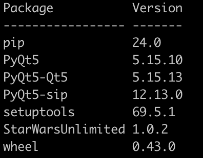
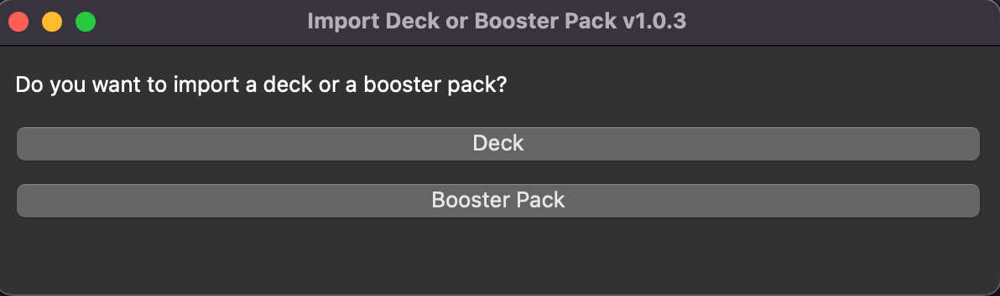
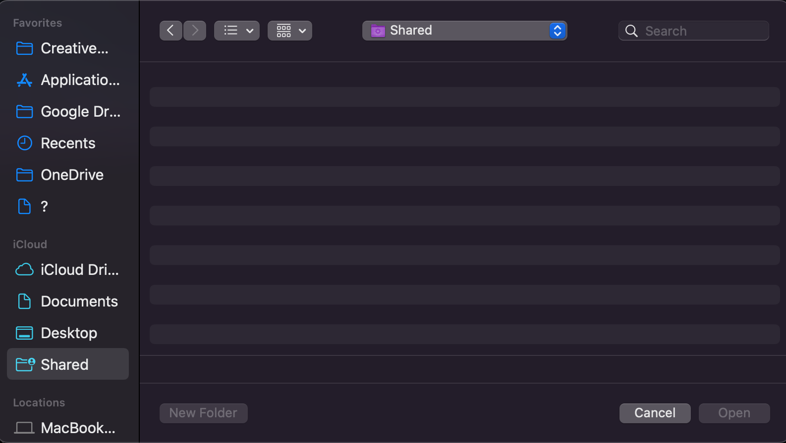
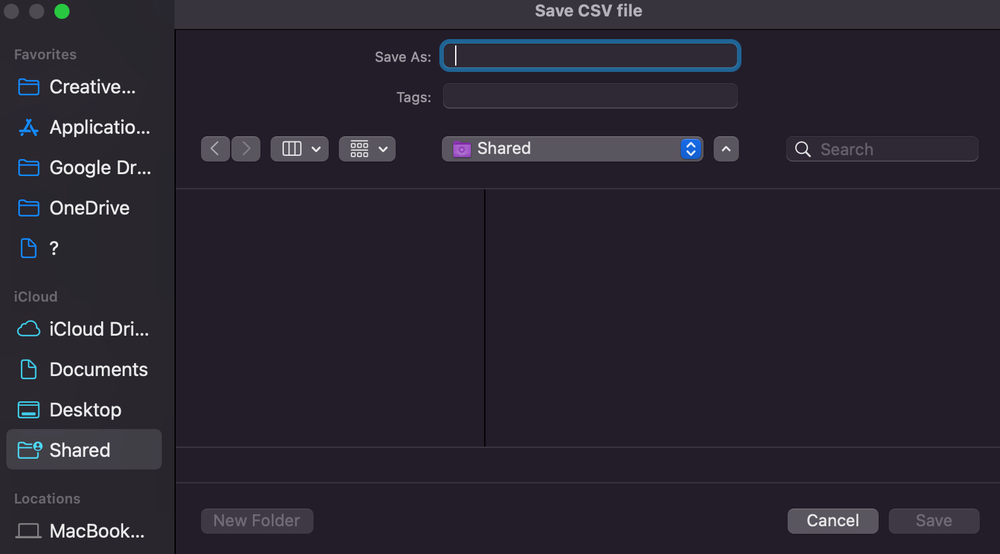
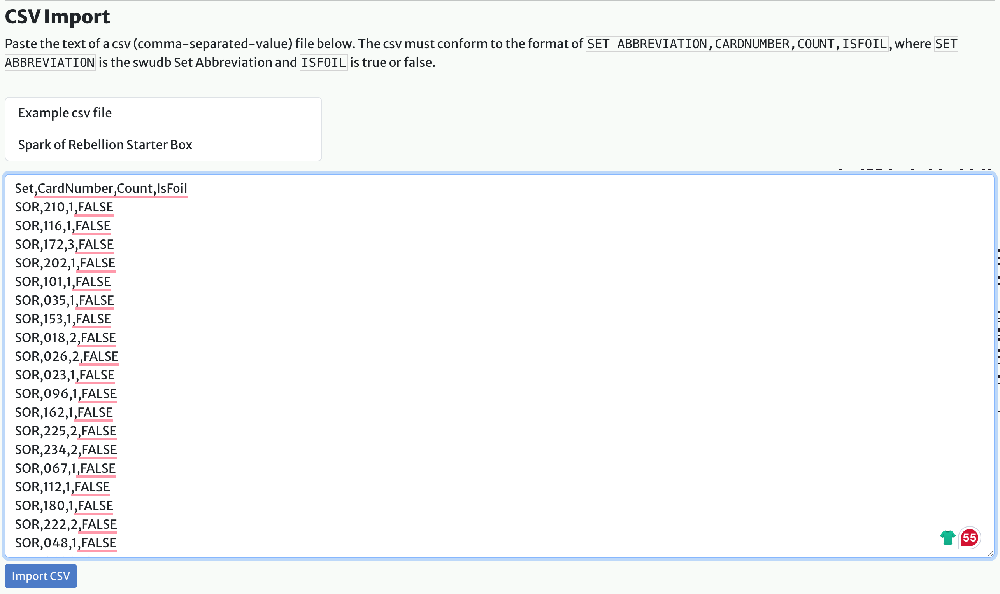

# Star Wars Unlimited gaming card
## Requirements
- Python 3.0.0 or above
- PyQt5

## Installation
If you want to import the decks in [swudb.com](https://swudb.com/) or you want to import the booster packs from [Table Top Simulator](https://store.steampowered.com/app/286160/Tabletop_Simulator/) you can use this python script

You can install the whl package by using:
```
pip install star_wars_unlimited-1.0.1-py3-none-any.whl
```

You can check the path of the installation by using:
```
pip show star_wars_unlimited
```
You can check the installation using 
```
pip list
```



## How to
You can use the python3 script executing it with:
```
python3 swu.py
```
 or the MACOS app with a double click

The first question is if you  want to import the deck .json file (taken from SWUDB.com) or a booster pack .json file from TTS:

 

Localize your json file (of a deck on swudb.com) or TTS



Save the resulting csv file where you want



Import the csv file into your collection on [swudb.com](https://swudb.com/)
My collection --> bulk actions --> CSV import



This is a digital way to enjoy this game but I recommend to buy it physically because you cannot enjoy the foil/hyperspace versions and ... it's a collectable game cards!

## Uninstall

Simply you can uninstall the script using
```
pip uninstall StarWarsUnlimited
```
and if you check the installation:
```
pip list
```
you will see everything has being uninstalled

And if you choose the MACOS application, you have only to discard it

## Resources
[ChatGPT](https://chatgpt.com/)

[swudb.com](https://swudb.com/)

[Table Top Simulator](https://store.steampowered.com/app/286160/Tabletop_Simulator/)

